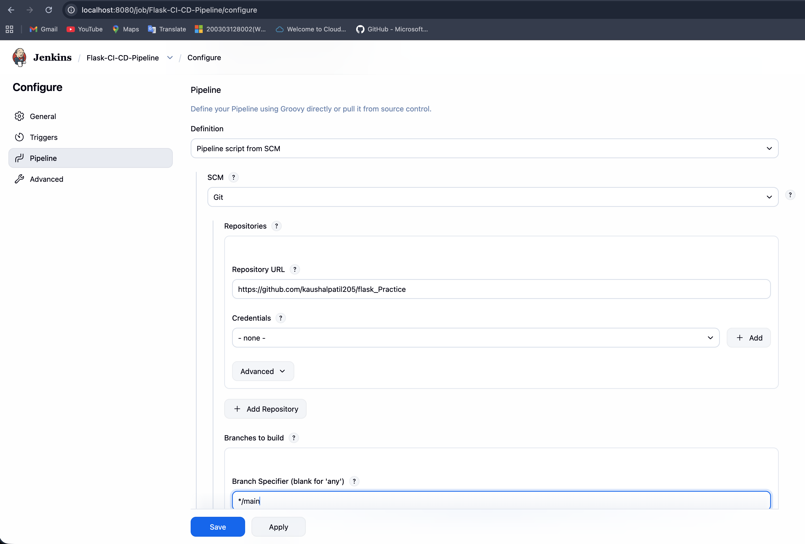
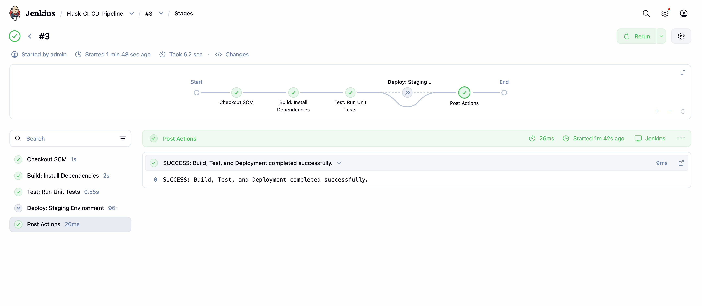
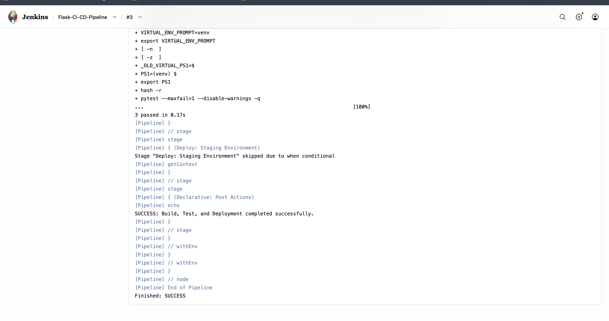
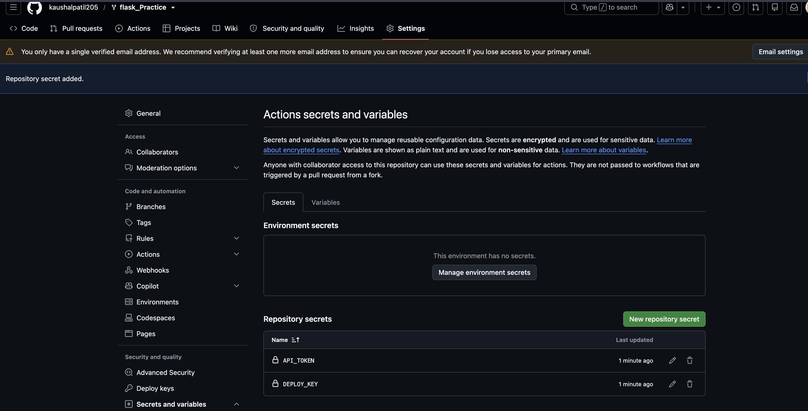
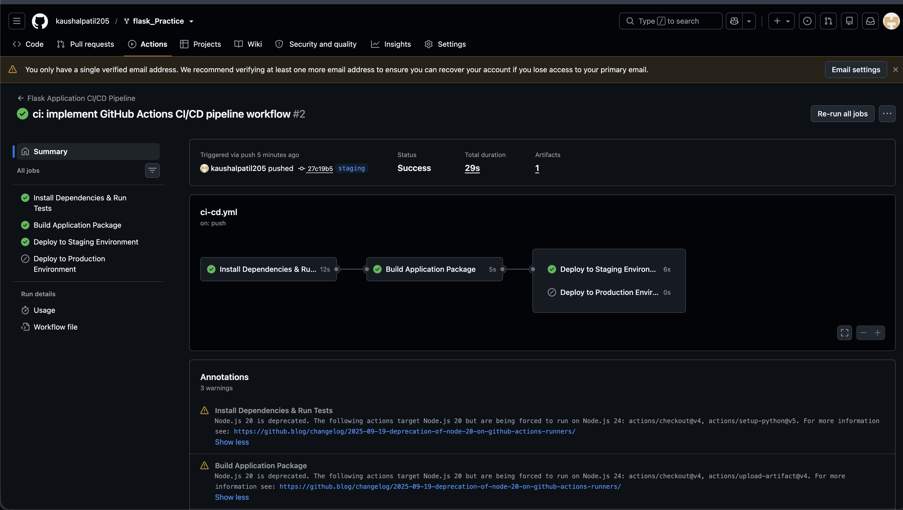
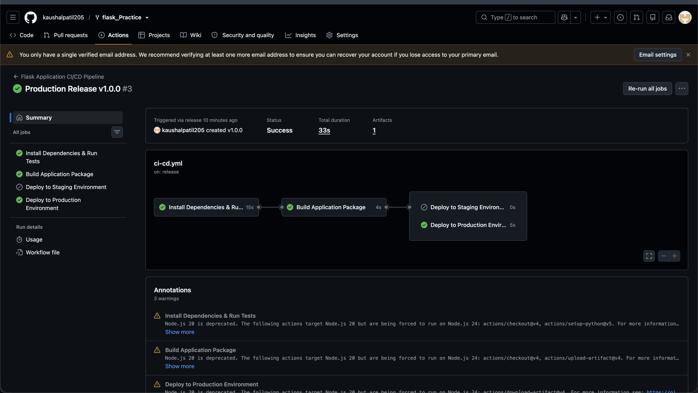

# 🚀 Continuous Integration & Continuous Deployment (CI/CD) Pipeline Assignment

This repository demonstrates an end-to-end automated DevOps pipeline for a Python Flask Web Application. It features two industry-standard CI/CD implementations:
1. **Jenkins Declarative Pipeline** (`Jenkinsfile`)
2. **GitHub Actions Workflow** (`.github/workflows/ci-cd.yml`)

---

## 🏛️ Architecture & Workflow Overview

```
[ Developer Pushes Code / Creates Release Tag ]
                      │
        ┌─────────────┴─────────────┐
        ▼                           ▼
  [ Jenkins Server ]        [ GitHub Actions ]
        │                           │
        ├── 1. Build & Pip Install  ├── 1. Install Dependencies
        ├── 2. Run Pytest Suite     ├── 2. Run Pytest Suite
        └── 3. Deploy to Staging    ├── 3. Package Build Artifacts
                                    ├── 4. Deploy to Staging (on `staging` branch push)
                                    └── 5. Deploy to Production (on Release Tag)
```

---

## 🛠️ Part 1: Jenkins CI/CD Pipeline

The Jenkins pipeline is defined in the `Jenkinsfile` at the root of this repository.

### Prerequisites & Setup Instructions
1. **Host Jenkins via Docker**:
   ```bash
   docker run -d --name jenkins-server -p 8080:8080 -p 50000:50000 -v jenkins_home:/var/jenkins_home jenkins/jenkins:lts
   ```
2. **Install Python inside Jenkins Container**:
   ```bash
   docker exec -u 0 -it jenkins-server bash -c "apt-get update && apt-get install -y python3 python3-pip python3-venv"
   ```
3. **Pipeline Configuration**:
   - Create a new **Pipeline Item** in Jenkins.
   - Point the **Definition** to `Pipeline script from SCM`.
   - Select **Git** and provide this repository URL (`https://github.com/kaushalpatil205/flask_Practice.git`).
   - Configure **Poll SCM** with `H/5 * * * *` to check for changes automatically every 5 minutes.

### 📸 Jenkins Execution Proofs

#### 1. Jenkins Pipeline Configuration


#### 2. Jenkins Stage View (Build, Test, Deploy)


#### 3. Jenkins Console Output & Test Results


---

## 🐙 Part 2: GitHub Actions CI/CD Pipeline

The cloud-native workflow is configured in `.github/workflows/ci-cd.yml`.

### How It Works
- **Push to `main`**: Runs unit tests and packages build artifacts.
- **Push to `staging`**: Automatically deploys the tested build to the Staging server.
- **GitHub Release Tag**: When a release is published (e.g., `v1.0.0`), the workflow triggers the **Deploy to Production** job.

### 🔐 Configuring Environment Secrets
To securely authenticate deployments without hardcoding credentials, navigate to **Settings > Secrets and variables > Actions** and add:
- `DEPLOY_KEY`: SSH private key for connecting to deployment servers.
- `API_TOKEN`: Authentication token for external cloud services.

### 📸 GitHub Actions Execution Proofs

#### 4. Configured GitHub Repository Secrets


#### 5. Successful Staging Pipeline Execution


#### 6. Successful Production Deployment (Triggered by Release Tag)


---

## 🚀 How to Run & Verify This Repository Locally

### 1. Clone the Repository
```bash
git clone https://github.com/kaushalpatil205/flask_Practice.git
cd flask_Practice
```

### 2. Set Up Virtual Environment & Run Tests
```bash
python3 -m venv venv
source venv/bin/activate
pip install -r requirements.txt
pip install pytest
pytest
```
